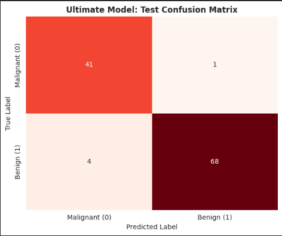
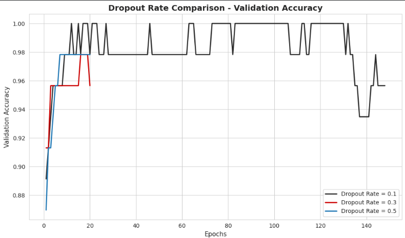
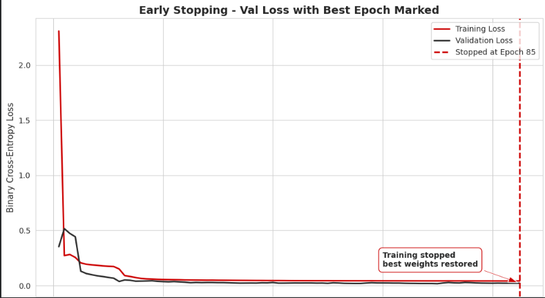
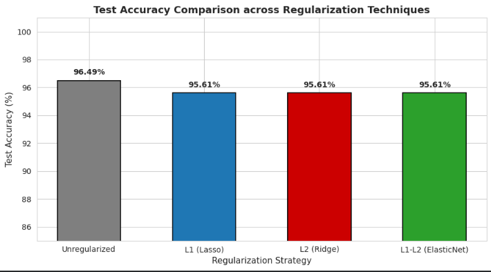
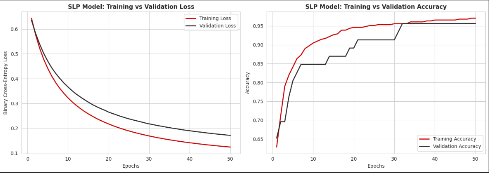

# 🧠 Breast Cancer Classification using Deep Learning

This project focuses on building a deep learning model to classify breast cancer as **benign** or **malignant** using medical data. The goal is to assist in early detection and improve diagnostic accuracy.

---

## 📌 Project Overview

Breast cancer is one of the most common cancers worldwide. Early detection plays a crucial role in successful treatment.  

In this project, multiple deep learning strategies were explored including:

- Dropout tuning  
- Regularization (L1, L2, ElasticNet)  
- Early stopping  
- Model performance comparison  

The final model achieved **~96.49% accuracy** on test data.

---

## 🎥 Project Demo

[![Watch the Demo]](https://drive.google.com/drive/folders/1h2r6VZQrIad9ja9RP670ag9ok692b4qL?usp=drive_link)

---

## 🚀 Features

- Deep learning-based classification  
- Hyperparameter tuning (dropout rates)  
- Regularization comparison  
- Early stopping for optimal training  
- Performance visualization using plots  

---

## 📊 Model Performance

### 🔹 Confusion Matrix (Final Model)

<p align="center">
  
</p>

- 41 Malignant correctly predicted  
- 68 Benign correctly predicted  
- Very low misclassification → strong model reliability  

---

### 🔹 Dropout Rate Comparison

<p align="center">
  
</p>

- Compared dropout: **0.1, 0.3, 0.5**  
- Moderate dropout gave stable accuracy  
- High dropout slightly reduced consistency  

---

### 🔹 Early Stopping Performance

<p align="center">
  
</p>

- Training stopped at optimal epoch (~85)  
- Prevented overfitting  
- Best model weights restored automatically  

---

### 🔹 Regularization Comparison

<p align="center">
  
</p>

| Technique | Accuracy |
|----------|--------|
| Unregularized | **96.49%** |
| L1 (Lasso) | 95.61% |
| L2 (Ridge) | 95.61% |
| ElasticNet | 95.61% |

👉 Observation: Model performs slightly better **without regularization** for this dataset.

---

### 🔹 Training vs Validation (SLP Model)

<p align="center">
  
</p>

- Smooth loss convergence  
- Training & validation closely aligned  
- No major overfitting observed  

---

## ⚙️ Installation

```bash
git clone https://github.com/Deepvejpara/deep-learning-breast-cancer-classification.git
cd deep-learning-breast-cancer-classification
pip install -r requirements.txt
```

---

## 🧪 Usage

```bash
jupyter notebook
```

Open:

```
DL_PR1.ipynb
```

---

## 📈 Evaluation Metrics

- Accuracy  
- Precision  
- Recall  
- F1-score  
- Confusion Matrix  

---

## 🛠️ Technologies Used

- Python  
- TensorFlow / Keras  
- NumPy, Pandas  
- Matplotlib  
- Scikit-learn  

---

## 👤 Author

**Deep Vejpara**  

---

## ⭐ Final Result

✅ ~96.49% accuracy achieved  
✅ Minimal overfitting  
✅ Strong classification performance  
